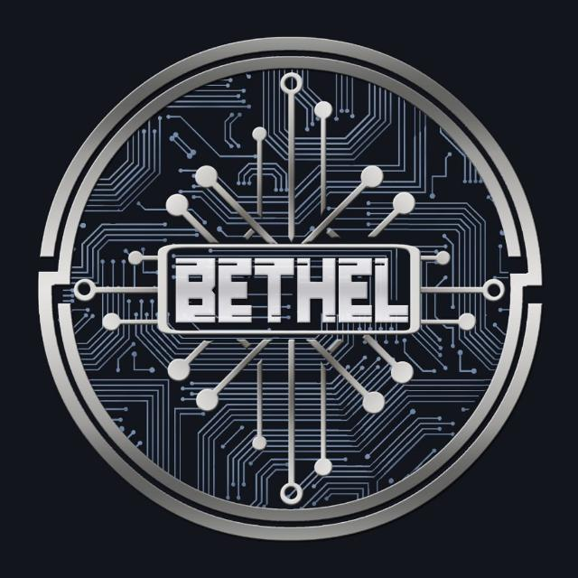

This is the working repository for Bethel 4.6.0, our fork of bitcoin-core 0.13.

For more information please visit the website:

 https://bethel.org/en/roadmap

## Building

For building the dependencies see [README.md](depends/README.md) in the [depends](depends) folder

For building the wallet see the markdown files in [doc](doc) folder

## Coin Specifications

| Specification | Value |
|:-----------|:-----------|
| Block Spacing | `30 seconds` |
| Stake Minimum Age | `2 hours` |
 | Stake Reward | `1 BTEL per block` |
| Port | `77770` |
| RPC Port | `77777` |

## Social Channels

| Site | link |
|:-----------|:-----------|
| Freenode IRC | #bethel-dev |
| Medium | https://medium.com/btel-coin |
| Twitter | https://twitter.com/Bethel |
| Discord | https://discord.gg/y4Vu9jw |
| Telegram | https://t.me/bethel |
| Reddit | http://www.reddit.com/r/bethel |
| Facebook | https://www.facebook.com/bethel |
| Instagram | https://www.instagram.com/bethel/ |
| Bitcointalk | |

## Community Resources

| Site         | link                                                                                                                    |
| :----------- | :---------------------------------------------------------------------------------------------------------------------- |
| Trello Board | [https://trello.com/btel-community](https://trello.com/invite/b/ |
| BtelHub       | http://btelhub.org                                                                                                       |

License
---------------------
Distributed under the [MIT software license](http://www.opensource.org/licenses/mit-license.php).
